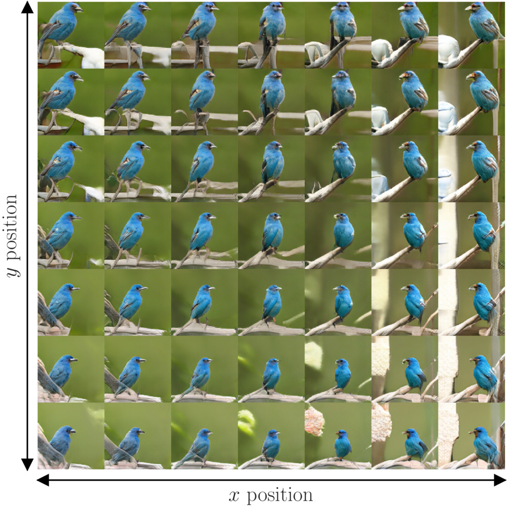

# Controlling generative models with continuous factors of variations

Antoine Plumerault, [Hervé Le Borgne](https://scholar.google.fr/citations?user=ZlKEgWYAAAAJ&hl=fr), [Céline Hudelot](https://scholar.google.fr/citations?user=gFlAh6MAAAAJ&hl=fr) \
*International Conference on Learning Representation*, 2020

If you use this code for your research, please site [our paper](https://openreview.net/forum?id=H1laeJrKDB):
```
@inproceedings{plumerault20iclr,
    title={Controlling generative models with continuous factors of variations},
    author={Antoine Plumerault and Herv{\'e} {Le Borgne} and C{\'e}line Hudelot},
    booktitle={International Conference on Machine Learning (ICLR)},
    year={2020},
    url={https://openreview.net/forum?id=H1laeJrKDB},
}
```
## Overview

This work aims at finding meaningfull directions in the latent space of generative models along which we can move to control precisely specific properties of the generated image like the position or scale of the object in the image. Our method does not require human annotations and is particularly well suited for the search of directions encoding simple transformations of the generated image, such as translation, zoom or color variations.

<p align="center">
  
</p>

## Installation

To set up the environment you can use the Dockerfile if you have nvidia-docker installed on your machine.

Alternatively, you can create a [Conda](https://docs.conda.io/en/latest/miniconda.html) environment with the required packages by running the following commands in a terminal:

```bash
conda create -n myenv
conda activate myenv

conda install matplotlib
conda install tensorflow-gpu
pip install tensorflow-datasets
conda install pytorch torchvision cudatoolkit=10.0 -c pytorch
conda install opencv
conda install scikit-image
conda install ipython
pip install tensorflow-hub
conda install Pillow=6.2.1
```

Manual installation using `pip` (and `requirements.txt`) can be tedious because of `opencv` and `tensorflow-gpu`.

We used `python 3.7`. The version of each package is reported in `requirements.txt`, but the code should work with the latest versions. 

Models weights can be found on the following drive:
https://drive.google.com/open?id=14mW_-13IGlIz_9nefLtVm-KOz87fLxui

Put biggan weights files e.g. `biggan_128.h5` in the `./src/models/biggan_imagenet/weights/` folder and the saliency model weights `final.pth` directly in the `./src/models/saliency/` folder.

### Models and weights

GAN model weights are taken from tensorflow-hub and have been converted when necessary to be compatible with tensorflow 2. Saliency model is taken from the official pytorch repository of the article describing the model of [Hou et. al. (2017)](https://github.com/Andrew-Qibin/PoolNet). 


## Usage

The program `scripts/run_example.sh` shows ho to run the full experiment with sensible hyperparameters. For  example, for class number `y=136` and the transform `scale` it executes:
```
cd src/
y=136
transform=scale
python3 main.py \
    --output_dir=../outputs/example \
    --image_size=128 \
    --y=$y \
    --transform=$transform \
    --num_trajectories=50 \
    --batch_size=10 \
    --n_steps=50 \
    --renorm \
    --save_images \
    --evaluation=quantitative \
    --num_traversals=50
```
The images generated are written in the folder `outputs/example/scale/136/trajectories/images/generated` for several values of the continuous parameter of variation `t`. It generates `num_trajectories=50` different trajectories, each at several scales, in the latent space and each corresponding image is available.


You can also run parts of the method like generate trajectory or learn the latent space model by using the appropriate file. Only vertical position, horizontal position, scale and brightness are implemented. Adding your own transformation requires writing code in `src/utils/transformation.py` and modifying slightly the other files.
